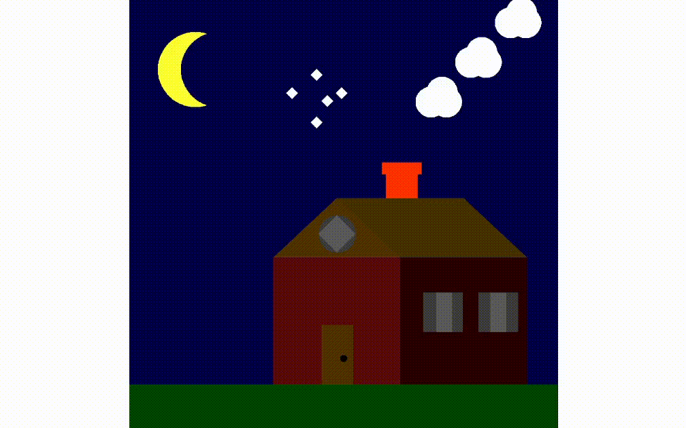

# Casa Simples com OpenGL

Este repositório contém um projeto simples de renderização de uma casa usando a biblioteca GLUT do OpenGL. 

O projeto inclui a criação da estrutura da casa, janelas, portas, estrelas brilhantes no céu noturno e simulação de fumaça saindo da chaminé.



## Como Executar

Para executar este projeto em seu ambiente, siga estas etapas:

1. Certifique-se de que você tenha o OpenGL e a biblioteca GLUT instalados em seu sistema.
```bash
sudo apt-get install mesa-utils freeglut3-dev
```
2. Para compilar utilize:


